<h1 align="center">Reading the Floor</h1>
<p align="center"><b>Private League Wide Shot Quality Model</b></p>
<p align="center"><sub>MIT Sloan Sports Analytics Conference 2027 · Research Paper Competition submission</sub></p>

<p align="center">
  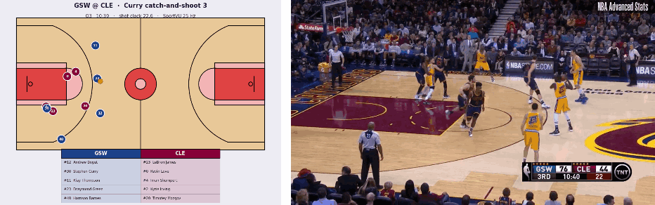
  <br><sub>Raw optical tracking reconstructed (left) beside the broadcast footage (right) — Curry's catch and shoot 3, GSW @ CLE.</sub>
</p>

<p align="center">
  
  
  
  
  
  
  
</p>

---

## Summary

The data franchises value most (practice tracking, biometrics, scheme indicators) is exactly what they will not share, yet pooled data builds the best models. Federated learning promises both: one league scale model, with no team handing over its raw records. We ask what that promise actually costs, and whether it is kept.

**Privacy is not a fixed tax on league wide modelling. It is a protocol choice.**

- **Federation alone is not privacy.** From a single tree sent during federated training, the coordinating server reconstructs each team's *exact* shots and makes in all 591 regions that tree defines. Adding noise to the tree's leaves does not stop it.
- **The obvious protocol is also the least accurate.** Letting each team grow its own trees costs **+6.4%** Brier. Growing shared trees from summed gradient histograms costs **nothing measurable** (−0.2%, 95% CI [−0.4, +0.1]).
- **Certified privacy is affordable.** Under secure aggregation plus distributed differential privacy, protecting every shot at ε = 1 still matches non-private tree bagging (AUC 0.688), and ε = 4 beats it (0.704). Protecting every *player* is harder and gets there at ε = 8.
- **Every franchise gains by joining.** Scored on its own shots, the shared model beats each team's solo model (mean +0.062 AUC, worst +0.034).

<p align="center">
  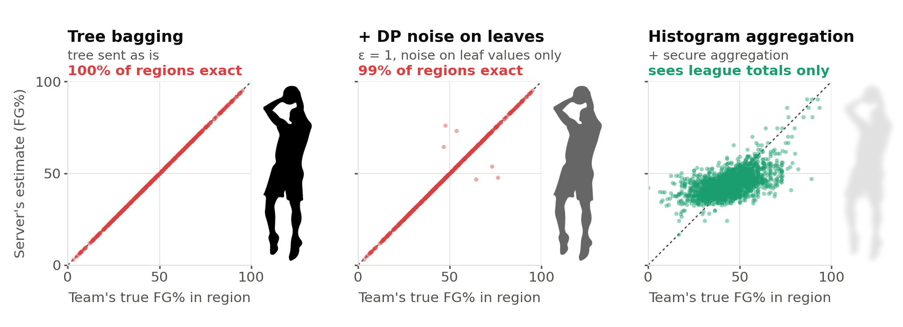
  <br><sub><b>What the coordinating server learns from one round of federated training.</b> One point per region of one team's transmitted tree. On the diagonal, the server knows that team's shooting exactly.</sub>
</p>

## Headline results

Federated rows are the mean over five seeds, with a game level bootstrap 95% CI against a centralized model trained on the same data with the same hyperparameters.

| What is shared | Configuration | Brier ↓ | ROC-AUC ↑ | Δ Brier vs centralized |
|---|---|---|---|---|
| Everything | Centralized (pooled raw data) | 0.2050 | 0.729 | — |
| No raw data | Tree bagging, team silos | 0.2181 | 0.685 | +6.4% [+5.7, +7.0] |
| No raw data | Cyclic, team silos | 0.2191 | 0.682 | +6.9% [+6.1, +7.6] |
| No raw data | **Histogram aggregation, team silos** | **0.2047** | **0.731** | **−0.2% [−0.4, +0.1]** |
| + SecAgg + DP, per shot | ε = 4 | 0.2133 | 0.704 | +4.0% |
| + SecAgg + DP, per shot | ε = 1 | 0.2183 | 0.688 | +6.5% |
| + SecAgg + DP, per player | ε = 8 | 0.2223 | 0.677 | +8.4% |
| Nothing | One team's own model (mean of 30) | 0.2249 | 0.659 | +9.7% |


## Findings

### 1. Federation alone is not privacy

In round 1 every shot starts from the same public prior, so the per-node statistics XGBoost ships with each tree invert exactly: a node's hessian sum gives how many shots reached it, and its gradient sum gives how many went in. The obvious hardening (strip those statistics, move split points onto a public grid) removes the counts but still leaves each region's FG% readable to within 1.4 points. The histogram protocol is no safer on its own: without secure aggregation, the server reads every team's exact shooting in all **21,017** (feature, bin) cells of the first tree. With **SecAgg+**, it only ever sees the league total.
→ [`leakage_attack.py`](src/federated/leakage_attack.py), [`leakage_attack_hist.py`](src/federated/leakage_attack_hist.py)

### 2. Protocol choice decides accuracy

Tree bagging lets every team grow its own trees on its ~2,500 shots, so splits are chosen from local noise and the model stalls far below centralized training. Aggregating gradient histograms grows **one shared tree** from everyone's data: without noise it is the centralized model, matching it to 10⁻⁷ in predicted probability. It runs end to end in **Flower** (five full seeds, up to ~3,300 message rounds each) and reproduces the simulation exactly (Brier 0.2047 ± 0.0001 in both).

<p align="center">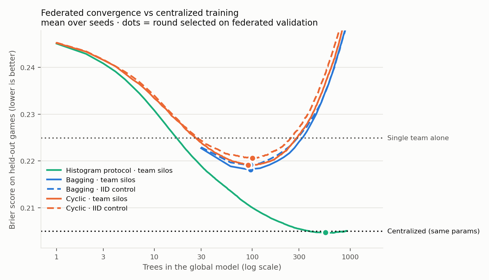</p>

### 3. Certified privacy is affordable

Each team adds its share of Gaussian noise to its histograms, and secure aggregation means the server only sees the noisy total. A Rényi-DP accountant charges **every** release: the starting prediction is the public league FG%, there is no per-tree validation, and nothing is tuned on private data.

- **Per shot**: ε = 1 → AUC 0.688; ε = 4 → 0.704.
- **Per player** (all of a player's shots, via per-player clipping): ε = 8 → 0.677. Below ε ≈ 2 most of the skill is gone.
- **Secure aggregation is load-bearing.** Without it, each team's release carries only its 1/√30 share of the noise, and ε = 1 is really ε ≈ 6 against the server.
- **Robust.** Tolerating 5 colluding or dropped teams costs 0.002 AUC. Discrete Gaussian noise on the SecAgg+ lattice, which a rigorous proof needs, costs nothing.
- **Audited.** A membership inference attack finds the non private model memorises its training shots (attack AUC 0.533, empirical ε ≥ 0.58). Every private model sits at chance.

<p align="center">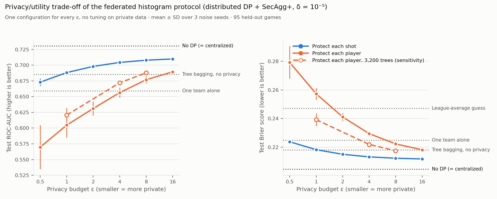</p>

### 4. Every franchise gains, and why the silos behave like an IID split

<table>
<tr>
<td width="45%">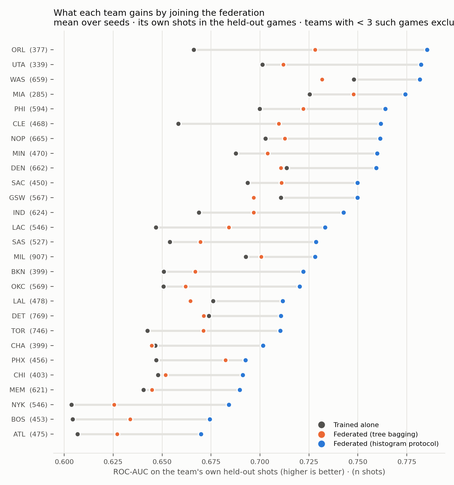</td>
<td width="55%">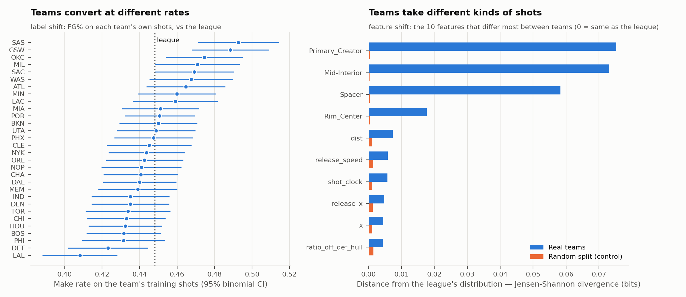</td>
</tr>
<tr>
<td align="center"><sub><b>Every team gains</b> — each team's own held-out shots, solo model vs shared model.</sub></td>
<td align="center"><sub><b>Teams differ in shot mix and roster</b>, not in what makes a shot go in.</sub></td>
</tr>
</table>

Teams differ a lot in *which* shots they take: make rates span 8.5 points, and the roster archetype mix diverges ~200× more than a random split. They do not differ in the shot-making relationship: a team's own model is only +0.009 AUC better on its own shots than its 29 rivals' models are. That is why the team partition performs like the IID control throughout.

## The shot quality model underneath

Every shot is reduced to **the game state at the moment of release**. 

<p align="center">
  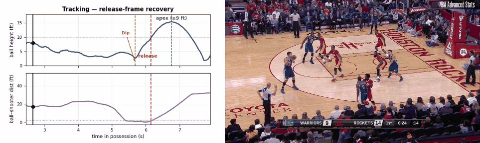
  <br><sub><b>Release frame recovery, synced to the broadcast</b> — Klay Thompson's catch and shoot 3 (GSW @ HOU).</sub>
</p>

Each shot carries 30 identity free features: shot geometry, defender pressure (distance, angle, closeout time, contest counts), shooter and defender kinematics, release mechanics, tempo (shot clock, touch time, catch and shoot), floor spacing, soft player archetypes from a Gaussian mixture model, and shot type (layup, dunk, floater, pull-up, …) parsed from the PBP text. 

<p align="center">
  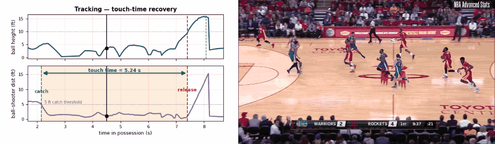
  <br><sub><b>Touch-time recovery</b> — 5.24 s of Harden dribbling into a pull-up 3, catch to release (GSW @ HOU).</sub>
</p>

An XGBoost classifier is trained on game disjoint splits and judged on **probability quality**, because everything downstream integrates the probability, not the label.

| Model | Brier ↓ | Log-loss ↓ | ROC-AUC ↑ |
|---|---|---|---|
| Constant (base rate) | 0.2472 | 0.6875 | 0.500 |
| Distance only logistic | 0.2411 | 0.6753 | 0.595 |
| **XGBoost (56 features)** | **0.2042** | **0.5914** | **0.732** |

<!-- <table>
<tr>
<td width="50%">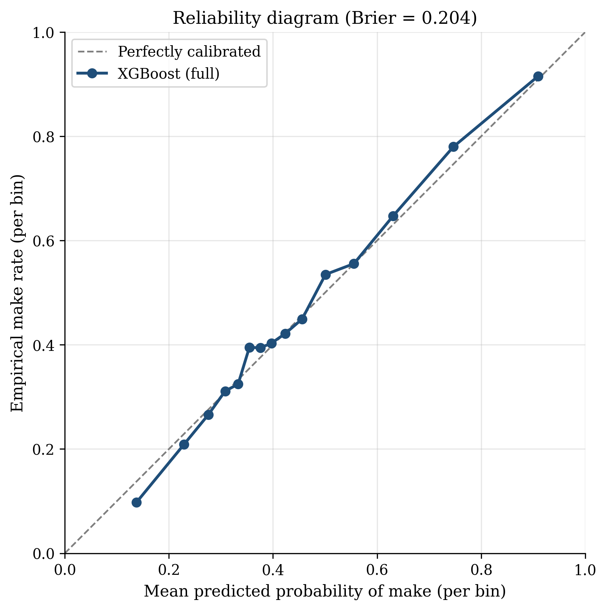</td>
<td width="50%"></td>
</tr>
<tr>
<td align="center"><sub><b>Calibration</b> — predicted probabilities track observed make rates.</sub></td>
<td align="center"><sub><b>What the model uses</b> — shot type first, then distance, defender pressure, release mechanics.</sub></td>
</tr>
</table> -->

## What the calibrated probability unlocks

With a trustworthy P(make), a shot's value over an average shooter in the same situation is `POE = value × (outcome − P(make))`, computed out of fold so no player is flattered by a model that trained on their own shots.

<p align="center">
  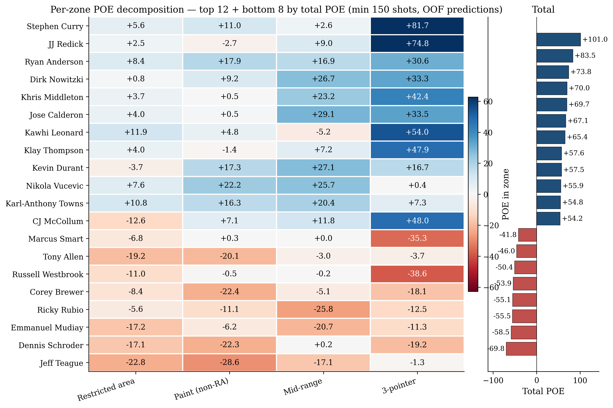
  <br><sub><b>Per-zone Points Over Expectation</b> — where each player creates or gives back expected points.</sub>
</p>

<table>
<tr>
<td width="50%"></td>
<td width="50%">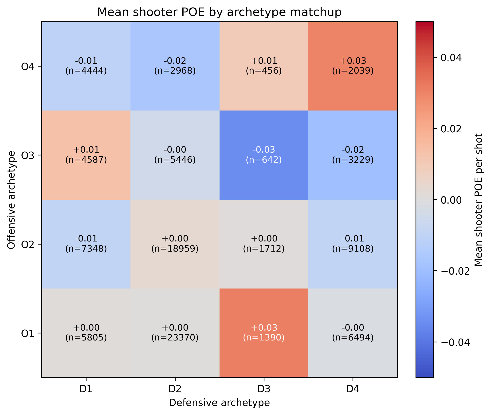</td>
</tr>
<tr>
<td align="center"><sub><b>Shot charts</b> — different players, different shot regimes.</sub></td>
<td align="center"><sub><b>Archetype matchups</b> — which offensive styles beat which defensive ones.</sub></td>
</tr>
</table>


## Repository tour
Module level details, the full runbook and every result file are in [`docs/ARCHITECTURE.md`](docs/ARCHITECTURE.md).
```
src/
  shot_features.py        Release frame recovery + per shot feature extraction
  train_xgboost.py        Canonical centralized model (game disjoint splits)
  poe/                    Out of fold Points Over Expectation (shooters, defenders, zones)
  federated/
    nba_federated/        Flower app: histogram protocol (hist_gbdt/_client/_server), tree bagging,
                          SecAgg+, distributed DP (dp.py), public bin grid (hardening.py)
    evaluate_federated.py Every federated vs centralized number, with game-level bootstrap CIs
    sim_histogram.py      Histogram protocol + DP sweeps (in process simulation)
    leakage_attack*.py    Reconstruction attacks on what each protocol transmits
    dp_audit.py           Membership inference audit of the released models
    per_team_benefit.py   Does every team gain by joining?
    team_heterogeneity.py How non-IID are the team silos?
clusters/                 R project: Gaussian mixture player archetypes
docs/                     Abstract, privacy section, architecture/runbook
```

## Limitations

- **The silos are simulated.** The 2015–16 SportVU corpus was shared league wide; it stands in for the data teams really guard.
- **The fixed DP configuration** matches what an exploratory sweep favoured, and the public bin ranges were set after seeing a data summary. Both would ideally be fixed from another season.
- **Not addressed:** malicious clients poisoning their contributions, and attacks on the released model beyond membership inference.

## Authors

**Juan Manuel Oliver** — KU Leuven · [LinkedIn](https://www.linkedin.com/in/juanma-oliver) · [Kaggle](https://www.kaggle.com/juanmaoliver)

**Rafa Galvez Vizcaino** — KU Leuven, COSIC

